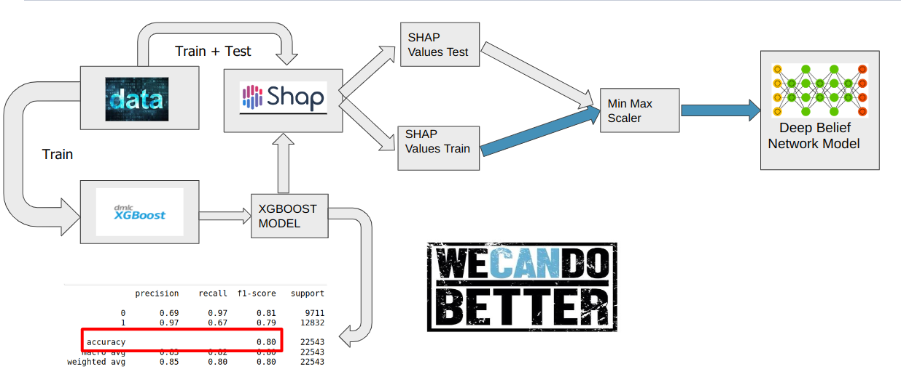
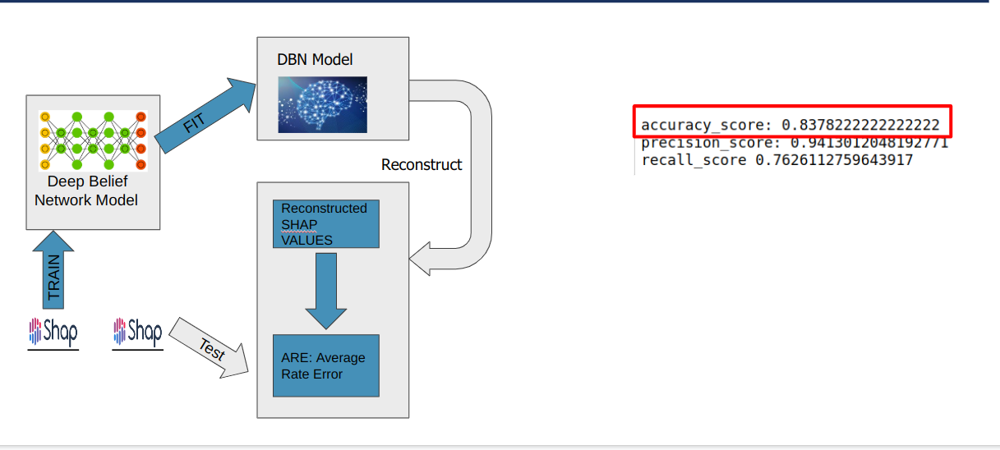

### Deep Belief Networks Project in Deep Learning Course


Tested in Python 3.9.2

Dataset is NSL-KDD.zip

create data dir:
```bash
mkdir -p data/raw/{val,test,train}
mkdir -p data/processed_nslkdd
mkdir -p models
```

### How to run

1. extract the zip file into data/raw
2. run the notebook: nsl_kdd_xgboost.ipynb to create the xgboost model and the decision vector, first time with training and after
HP optimization with test data
3. run shap.ipynb to create SHAP values with xgboost model
4. run model_fit_dbn.ipynb in order to create DBN model, then use the SHAP values to reconstruct the decision vector
5. run ensemble.ipynb which uses an ensemble decision using OR with the previous SHAP decision vector and the
XGBoost decision vector  
Then, there should be the following csv's
3. run the notebook: nslkdd_model_runner.ipynb in order to train and fit the model


Project Layout


This Project is based on the work of: albertbup

A Python implementation of Deep Belief Networks built upon NumPy and TensorFlow with scikit-learn compatibility

https://github.com/albertbup/deep-belief-network

### Project parts:

The project is splitted into 4 notebooks as following, in addition we have a supplement to the DBN code 
(dbn_nslkdd/dbn/tensorflow/models) with the following functions:

**reconstruct:** Reconstructs the visible layer from the last hidden layer

**reconstruct_k:** Makes k reconstructions
    
**impute:** Impute missing values, represented as nan


### Notbooks (ordered):

* (1) nsl_kdd_xgboost.ipynb - this will run XGBoost to build the model

* (2) shap.ipynb - run SHAP with xgboost model

* (3) model_fit_dbn.ipynb - using the SHAP values, fit the DBM model, run the reconstruction

* (4) ensemble.ipynb - the final ensemble model - combines the DBN and the XGBoost with OR. This notebook will show the model final resulys

# High level flow

#### Supervised Stage



#### Un-Supervised Stage

